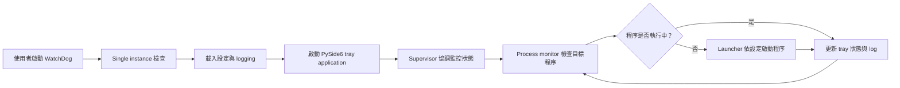
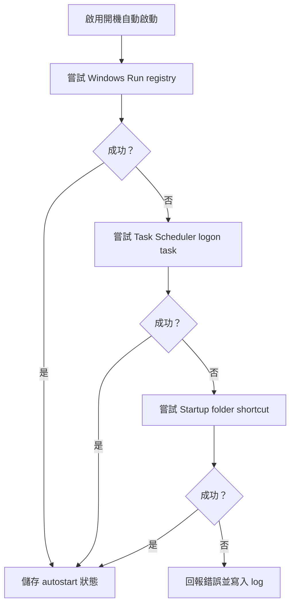

# WatchDog

WatchDog 是一個 Windows-first watchdog tray application，以 Python 與 PySide6 實作。專案目標是讓使用者透過系統托盤工具監控與管理指定程序，並提供 logging、autostart fallback、single instance 與 Windows EXE 打包流程。

## 專案重點

- Windows 系統托盤應用程式，支援背景執行與狀態顯示。
- 監控指定程序狀態，並集中管理啟動、停止與監控流程。
- 提供 log 儲存與錯誤追蹤，方便排查啟動與監控問題。
- 支援多層 autostart fallback：Windows Run registry、Task Scheduler、Startup folder shortcut。
- 使用模組化 `src/watchdog_app` 結構，並以 pytest 覆蓋主要行為。
- 支援 PyInstaller 與 Nuitka 打包成 Windows 可執行檔。

## 監控流程



WatchDog 將 UI、監控、啟動、狀態協調與儲存拆成獨立模組。GUI 負責操作入口與狀態顯示，`supervisor.py` 負責協調監控流程，`monitor.py` 與 `launchers.py` 分別處理程序檢查與啟動行為。

## 技術棧

- Python 3.12
- PySide6
- psutil
- pytest
- PyInstaller
- Nuitka

## 目錄結構

```text
src/watchdog_app/        應用程式核心模組
src/watchdog_app/gui/    PySide6 UI 與 dialogs
src/watchdog_app/assets/ icon assets
tests/                   pytest 測試
scripts/                 PyInstaller / Nuitka 打包腳本
```

主要模組：

- `monitor.py`：程序監控流程。
- `launchers.py`：程序啟動相關邏輯。
- `autostart.py`：Windows autostart provider 與 fallback。
- `logging_utils.py`：log 設定與輸出。
- `storage.py`：設定與資料儲存。
- `single_instance.py`：單一執行個體控制。
- `supervisor.py`：監控與執行狀態協調。

## Logging

Log 檔會寫入：

```text
<log storage root>\WatchDogLogs\<yyyy-MM-dd>\WatchDog_<yyyy-MM-dd-HH-mm-ss>.log
```

log 可用於追蹤啟動、監控、autostart 與背景執行問題。

## Autostart

Autostart providers 會依序嘗試：

1. Windows Run registry key
2. Windows Task Scheduler logon task
3. Windows Startup folder shortcut (`WatchDog.lnk`)

此設計讓工具在不同 Windows 權限與環境下有 fallback 行為。



## 開發環境

建立環境並安裝依賴：

```powershell
py -3.12 -m venv WatchDogEenv
.\WatchDogEenv\Scripts\Activate.ps1
python -m pip install -r requirements.txt
```

執行測試：

```powershell
.\WatchDogEenv\Scripts\python -m pytest
```

## 打包

從 `cmd.exe` 執行：

```cmd
scripts\build_pyinstaller.cmd
scripts\build_nuitka.cmd
```

也可以直接執行 PowerShell 腳本：

```powershell
.\scripts\build_pyinstaller.ps1
.\scripts\build_nuitka.ps1
```

打包輸出會依工具設定產生在對應的 build / dist 目錄。

打包流程保留 PyInstaller 與 Nuitka 兩種路徑，方便比較啟動速度、檔案大小與相依套件處理結果。若只需要一般 Windows EXE，可先使用 PyInstaller；若要進一步調整效能或輸出形式，再使用 Nuitka。

## 測試範圍

測試涵蓋：

- autostart provider
- process monitor
- launcher
- logging utilities
- storage
- runtime
- single instance
- supervisor
- UI behavior

測試重點放在不依賴完整 GUI 操作也能驗證核心行為：autostart provider fallback、process monitor 判斷、launcher 參數、logging 路徑、storage 讀寫、single instance 與 supervisor 狀態協調。這讓後續修改監控或啟動流程時，可以先用 pytest 驗證主要邏輯。

## 注意事項

- 本專案以 Windows 環境為主要目標。
- 打包與 autostart 相關流程可能需要對應的 Windows 權限。
- 若要修改 autostart 或 logging 行為，請同步更新測試。
